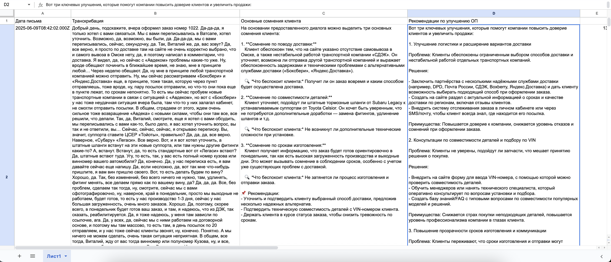

# AI Call Transcription & Quality Control

> **Автоматизируйте контроль качества звонков отдела продаж в несколько кликов**  
> Gmail → Make (Whisper + GPT‑4o) → Google Sheets → ⚡ инсайты без рутины


## TL;DR

Этот репозиторий содержит готовый **blueprint Make**, образцы данных и инструкции, которые помогут вам:

1. **Забрать** записи звонков из Gmail  
2. **Транскрибировать** аудио c помощью OpenAI Whisper  
3. **Выявить** ключевые сомнения клиента и получить рекомендации от GPT‑4o  
4. **Сохранить** результаты в Google Sheets (дата, транскрибация, сомнения, рекомендации, токены)  
5. **Получать аналитику** в реальном времени — без прослушивания каждого звонка

## Demo

| Make Scenario | Google Sheets Output |
|---------------|---------------------|
|  |  |

## 📂 Структура репозитория

```
.
├── make-blueprint/               # .json для импорта в Make
│   └── call_quality_control.json
├── data/
│   ├── analytics_sample.csv      # пример результата 
│   ├── sample_call_1             # демо‑аудио
│   └── sample_call_2             # демо‑аудио
├── screenshots/
│   ├── google_sheets_results.png # изображения
│   └── make_scenario.png 
├── .gitignore
├── LICENSE
└── README.md  ← you are here
```

## ⚙️ Быстрый старт

```bash
# 1. Клонируем репозиторий
git clone https://github.com/<your‑org>/call-quality-control.git
cd call-quality-control

# 2. Заполняем переменные окружения
cp .env.example .env
#   OPENAI_API_KEY=
#   GOOGLE_SERVICE_ACCOUNT_JSON=
#   GMAIL_FILTER=from:sip@yourpbx.com

# 3. Импортируем blueprint в Make
#    Make > Scenarios > ⋯ > Import blueprint > make-blueprint/call_quality_control.json

# 4. Указываем свои подключения (Gmail, Google Sheets, OpenAI)
# 5. Запускаем «Run once», убеждаемся, что всё работает
# 6. Переключаем сценарий в режим ON — готово!
```

## 🧠 Как это работает

1. **Gmail ▶ Watch Emails** — ловим входящие письма со записями звонков  
2. **Router** — делим поток по менеджерам / проектам  
3. **OpenAI ▶ Create Transcription (Whisper‑1)** — получаем текст  
4. **OpenAI ▶ Create Chat Completion (GPT‑4o)**  
   * *System:* «Ты — руководитель отдела продаж…»  
   * *User:* «На основании текста выдели 3 основных сомнения…»  
5. **OpenAI ▶ Create Chat Completion (GPT‑4o)** — генерируем 3 рекомендации  
6. **Google Sheets ▶ Add a Row** — пишем дату, транскрибацию, сомнения, рекомендации и кол‑во токенов

Схема расширяема: можно добавить Telegram‑бот, Slack оповещения, Notion‑таски и т.д.

## 📊 Пример результата

Фрагмент `data/analytics_sample.csv`:

| Дата | Транскрибация (обрезано) | Сомнения (обрезано) | Рекомендации (обрезано) | Tokens (in/out) |
|------|-------------------------|---------------------|-------------------------|-----------------|
| 2025‑06‑09 08:42 | Добрый день, подскажите, вчера оформи... | Клиент не уверен в гарантии... | Уточнить гарантию, предложить… | 1387 / 943 |
| 2025‑06‑09 08:41 | Алло, добрый день, компания Хэлми... | Клиент переживает о сроках... | Прозрачные сроки, follow‑up... | 664 / 848 |


## 💡 Бизнес‑ценность

* **Сокращение времени** руководителя: 100+ звонков анализируются за минуты  
* **Рост конверсии** — выявляем скрытые возражения и улучшаем скрипты  
* **Продаваемое решение**: стоимость минутной транскрибации ≈ 1 ₽, средняя цена услуги на рынке — 3‑4 ₽/мин + единоразовая интеграция 30‑40 тыс. ₽

## 🛣 Roadmap

- [ ] Автогенерация отчёта в Notion / PDF  
- [ ] Интеграция с CRM (Bitrix24, HubSpot)  
- [ ] SMM‑эксперт с автопостингом (модуль урока PE7.2)  
- [ ] Расширенная аналитика (эмо‑тональность, речь менеджера)  

## 🤝 Contributing

PR и issue‑запросы приветствуются!  
См. [`CONTRIBUTING.md`](CONTRIBUTING.md) для деталей.

## 📝 License

[MIT](LICENSE) © 2025 Fedor Sablin
